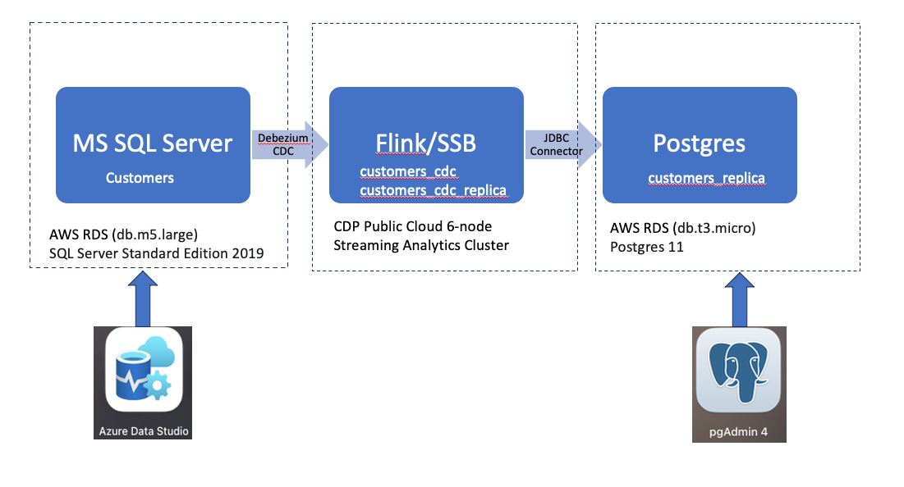
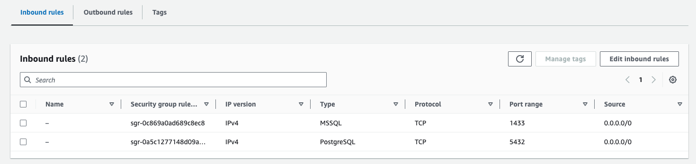
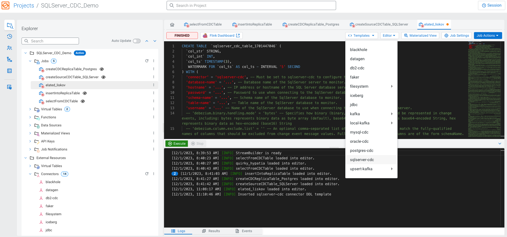
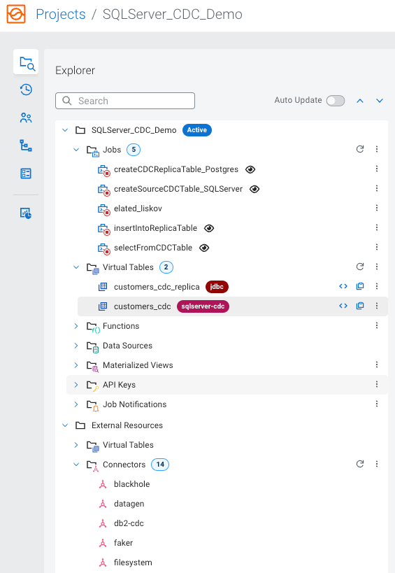
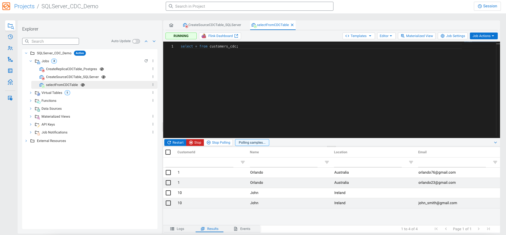
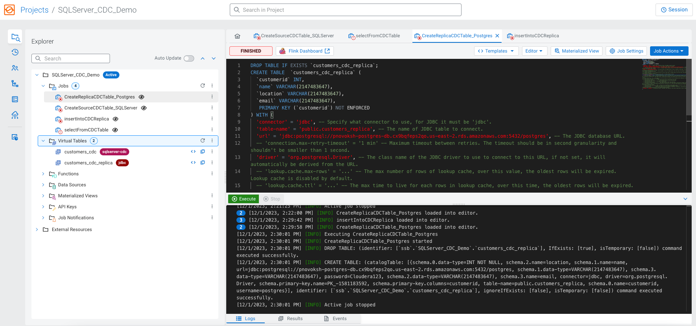
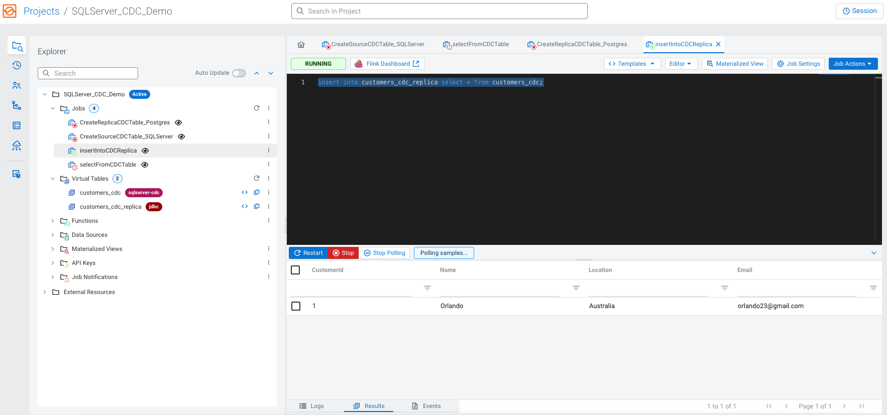
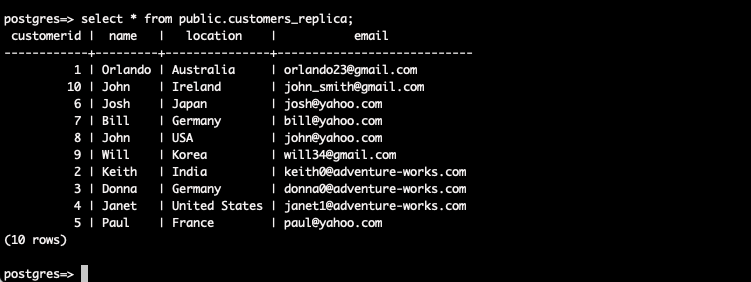
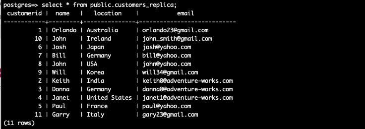
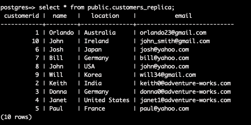

# MS SQL Server Change Data Capture (CDC) Demo

MS SQL Server is a very popular database in the corporate world. Cloudera's SQL Stream Builder/SSB product comes with several Debezium CDC connectors (for MS SQL Server, Postgres, Oracle and DB2) which allow capturing database changes, processing and routing those changes using Flink SQL into various target sinks including Postgres, MySQL, Hive, Kafka and etc. 
The purpose of this demo is to setup Change Data Capture (CDC) Replication for MS SQL Server instance using SQL Stream Builder (SSB)/Flink and send those changes into another database (Postgres). 

MS SQL Server and Postgres instances are running on AWS RDS Relational Database service, while Flink/SQl Stream Builder is deployed on the Cloudera CDP Public Cloud cluster. 

The overall demo architecture is presented on the diagram below. 



## Deploying database servers

It is fairly easy to deploy new database instances in RDS. Make sure that your database instances are Publicly Accessible. Change data capture feature is only available in the Enterprise, Developer, Enterprise Evaluation, and Standard editions,
so SQL Server Express edtion can't be used for CDC. Once the database instance is deployed, you need to capture the endpoint, a port number (1433), as well as the username and password to connect to the instance. Security Group inbound rules should 
allow traffic for database ports 1433 and 5432, as shown below.



## Lab 1 – Creating a SQL Server database table

I used Azure Data Studio to connect to the SQL Server instance, create and populate a new database table. You can also use VS Code with SQL Server extensions. The following code will create a new database, enable CDC replication, create and populate a **Customers** table.

```
USE master;
GO

IF NOT EXISTS (
SELECT name
FROM sys.databases
WHERE name = N'TutorialDB'
)
CREATE DATABASE [TutorialDB];
GO

IF SERVERPROPERTY('ProductVersion') > '12'
ALTER DATABASE [TutorialDB] SET QUERY_STORE = ON;
GO

-- Create a new table called 'Customers' in schema 'dbo'
-- Drop the table if it already exists
IF OBJECT_ID('dbo.Customers', 'U') IS NOT NULL
DROP TABLE dbo.Customers;
GO

-- Create the table in the specified schema
CREATE TABLE dbo.Customers (
CustomerId INT NOT NULL PRIMARY KEY, -- primary key column
[Name] NVARCHAR(50) NOT NULL,
[Location] NVARCHAR(50) NOT NULL,
[Email] NVARCHAR(50) NOT NULL
);
GO

USE TutorialDB;

--Enable CDC for RDS DB Instance
exec msdb.dbo.rds_cdc_enable_db '<database name>'

--Begin tracking a table
exec sys.sp_cdc_enable_table   
@source_schema           = N'dbo'
,  @source_name             = N'Customers'
,  @role_name               = N'public'

-- Insert rows into table 'Customers'
INSERT INTO dbo.Customers (
[CustomerId],
[Name],
[Location],
[Email]
)
VALUES
(1, N'Orlando', N'Australia', N''),
(2, N'Keith', N'India', N'keith0@adventure-works.com'),
(3, N'Donna', N'Germany', N'donna0@adventure-works.com'),
(4, N'Janet', N'United States', N'janet1@adventure-works.com')
GO
```

##Lab 2 – Creating SQL Server table in SSB

You need to let SSB know the source table to capture changes from. SSB comes with the set of templates that you can use to create various CDC tables as shown below.
Create a new job in SSB, click the Templates drop down menu and choose sqlserver-cdc. You can modify you table DDL per example below.



  

```
DROP TABLE IF EXISTS `customers_cdc`;
CREATE TABLE  `customers_cdc` (
  CustomerId INT,
  Name STRING,
  Location STRING,
  Email STRING
) WITH (
  'connector' = 'sqlserver-cdc', -- Must be set to sqlserver-cdc to configure this connector.
  'database-name' = 'TutorialDB', -- Database name of the SqlServer server to monitor.
  'hostname' = '<your-RDS-endpoint>', -- IP address or hostname of the SQL Server database server.
  'password' = '<user password>', -- Password to use when connecting to the SqlServer database server.
  'schema-name' = 'dbo', -- Schema name of the SqlServer database to monitor.
  'table-name' = 'Customers', -- Table name of the SqlServer database to monitor.
  'username' = '<user name>', -- Name of the SqlServer database to use when connecting to the SqlServer database server.
'debezium.snapshot.mode' = 'initial', -- A mode for taking an initial snapshot of the structure and optionally data of captured tables. Once the snapshot is complete, the connector will continue reading change events from the database’s redo logs. The following values are supported:                                                                             initial: Takes a snapshot of structure and data of captured tables; useful if topics should be populated with a complete representation of the data from the captured tables.                                                                             initial_only: Takes a snapshot of structure and data like initial but instead does not transition into streaming changes once the snapshot has completed.                                                                             schema_only: Takes a snapshot of the structure of captured tables only; useful if only changes happening from now onwards should be propagated to topics.
  'port' = '1433' -- Integer port number of the SQL Server database server.
  -- 'scan.startup.mode' = 'initial' -- Optional startup mode for SqlServer CDC consumer, valid enumerations are initial, initial-only, latest-offset.
);
```

Run the code by executing the job and you should see the new virtual table definition as shown below.



##Lab 3 - Capturing Database Changes

Once you've created a virtual CDC table, you can select from it by running a simple select statement in SSB job. When you change rows in the source SQL Server table or add new ones the changed rows will be visible in SSB UI, as shown below.




Run a few SQL commands in Azure Data Studio to update database rows or insert new ones. 

```
update Customers set Email='orlando23@gmail.com' where CustomerId=1;
INSERT INTO dbo.Customers (
   [CustomerId],
   [Name],
   [Location],
   [Email]
)
VALUES
   (10, N'John', N'Ireland', N'');

update Customers set Email='john_smith@gmail.com' where CustomerId=10;
```

##Lab 4 - Replicating Database Changes

Now, let's create a target ***customers_replica*** Postgres table where we would replicate changes performed on the original MS SQL Server table. Logon to Postgres and run the following commands. You can install a Postgres client of your choice. 
I'm using psql installed locally on my Mac. Another option would be to use PGADMIN tool.

```
psql -h <your-RDS-endpoint-for-postgres> -U postgres

CREATE TABLE IF NOT EXISTS public.customers_replica
(
customerid integer NOT NULL,
name text COLLATE pg_catalog."default",
location text COLLATE pg_catalog."default",
email text COLLATE pg_catalog."default",
CONSTRAINT "Customers_replica_pkey" PRIMARY KEY (customerid)
)
WITH (
OIDS = FALSE
)
TABLESPACE pg_default;

ALTER TABLE IF EXISTS public.customers_replica
OWNER to postgres;

```

Let's create a virtual table in SSB using the following code. In SSB UI you can create a new job and use a "jdbc" Template. You can modify your table DDL per example below.

```
DROP TABLE IF EXISTS `customers_cdc_replica`;
CREATE TABLE  `customers_cdc_replica` (
`customerid` INT,
`name` VARCHAR(2147483647),
`location` VARCHAR(2147483647),
`email` VARCHAR(2147483647),
PRIMARY KEY (`customerid`) NOT ENFORCED
) WITH (
'connector' = 'jdbc', -- Specify what connector to use, for JDBC it must be 'jdbc'.
'table-name' = 'public.customers_replica', -- The name of JDBC table to connect.
'url' = 'jdbc:postgresql://<your-RDS-endpoint-for-postgres>:5432/postgres', -- The JDBC database URL.
-- 'connection.max-retry-timeout' = '1 min' -- Maximum timeout between retries. The timeout should be in second granularity and shouldn't be smaller than 1 second.
'driver' = 'org.postgresql.Driver', -- The class name of the JDBC driver to use to connect to this URL, if not set, it will automatically be derived from the URL.
-- 'lookup.cache.max-rows' = '...' -- The max number of rows of lookup cache, over this value, the oldest rows will be expired. Lookup cache is disabled by default.
-- 'lookup.cache.ttl' = '...' -- The max time to live for each rows in lookup cache, over this time, the oldest rows will be expired. Lookup cache is disabled by default.
-- 'lookup.max-retries' = '3' -- The max retry times if lookup database failed.
'password' = '<password>', -- The JDBC password.
-- 'scan.auto-commit' = 'true' -- Sets the auto-commit flag on the JDBC driver, which determines whether each statement is committed in a transaction automatically. Some JDBC drivers, specifically Postgres, may require this to be set to false in order to stream results.
-- 'scan.fetch-size' = '0' -- The number of rows that should be fetched from the database when reading per round trip. If the value specified is zero, then the hint is ignored.
-- 'scan.partition.column' = '...' -- The column name used for partitioning the input.
-- 'scan.partition.lower-bound' = '...' -- The smallest value of the first partition.
-- 'scan.partition.num' = '...' -- The number of partitions.
-- 'scan.partition.upper-bound' = '...' -- The largest value of the last partition.
-- 'sink.buffer-flush.interval' = '1 s' -- The flush interval mills, over this time, asynchronous threads will flush data. Can be set to '0' to disable it. Note, 'sink.buffer-flush.max-rows' can be set to '0' with the flush interval set allowing for complete async processing of buffered actions.
-- 'sink.buffer-flush.max-rows' = '100' -- The max size of buffered records before flush. Can be set to zero to disable it.
-- 'sink.max-retries' = '3' -- The max retry times if writing records to database failed.
-- 'sink.parallelism' = '...' -- Defines the parallelism of the JDBC sink operator. By default, the parallelism is determined by the framework using the same parallelism of the upstream chained operator.
'username' = 'postgres' -- The JDBC user name. 'username' and 'password' must both be specified if any of them is specified.
);
```

You should see the new table in SSB UI as shown below.



Now we're ready to replicate changes from SQL Server to Postgres by running a simple INSERT/SELECT job in SSB UI. Create and run a new job in SSB UI. As simple as that.

```
insert into customers_cdc_replica select * from customers_cdc;
```



You should see database changes in the SSB UI and by selecting from the Postgres table itself.



Let's update table records on the SQL Server side and observe changes in Postgres. The new row was added and updated on the SQL Server side and replicated to Postgres. 

```
INSERT INTO dbo.Customers (
   [CustomerId],
   [Name],
   [Location],
   [Email]
)
VALUES
   (11, N'Garry', N'Italy', N'');

update Customers set Email='gary23@gmail.com' where CustomerId=11;
```



Let's remove the row that was inserted above on the SQL Server side and check that the same row was deleted from Postgres.

```
delete from Customers where CustomerId=11;
```


