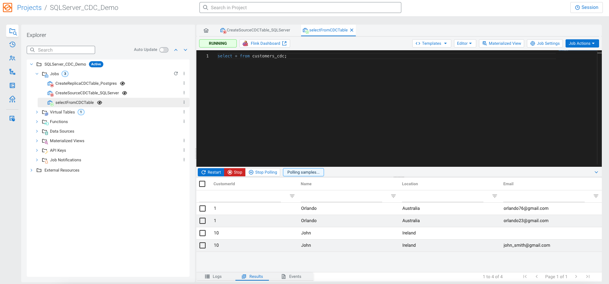
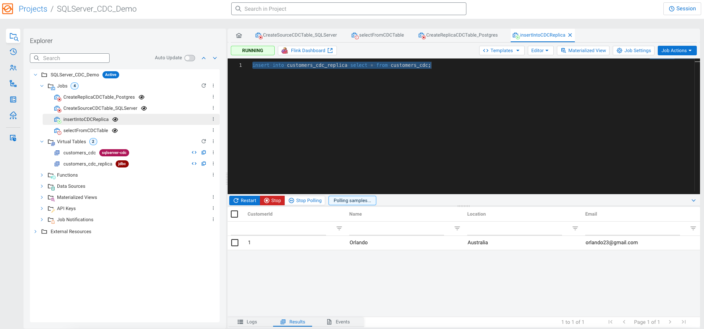

# MS SQL Server Change Data Capture (CDC) Demo

MS SQL Server is one of the most popular databases in the corporate world. Cloudera's SQL Stream Builder (SSB) product comes with several Debezium CDC connectors (for MS SQL Server, Postgres, Oracle and DB2) which allow capturing database changes, processing and routing those changes using Flink SQL into various target sinks including Postgres, MySQL, Hive, Kafka and etc. 
The purpose of this demo is setting Change Data Capture (CDC) Replication for MS SQL Server instance using SQL Stream Builder (SSB)/Flink and sending database changes to Postgres and Hive tables. 

MS SQL Server and Postgres instances are running on AWS RDS (Relational Database service), while Flink/SQL Stream Builder and Hive are deployed on the Cloudera Public Cloud environment on AWS. 

The overall demo architecture is presented on the diagram below.


## 1 - Deploying database servers

It's very easy to deploy new database instances in Amazon RDS. Make sure that your database instances are publicly accessible. For SQL Server, Change Data Capture feature is only available in the Enterprise, Developer, Enterprise Evaluation, and Standard editions. Once the database instance is deployed, you need to grab the endpoint, a port number (1433), as well as the username and password to connect to the instance. Security Group inbound rules should 
allow traffic for database ports 1433 and 5432, as shown below.


## 2 – Creating a SQL Server database table

I use Azure Data Studio to connect to the SQL Server instance, create and populate a new database table. You can also use VS Code with SQL Server extensions or any other client tool of your choice. Run the following code to create a new database, enable CDC replication, create and populate a **Customers** table.

```
USE master;

IF NOT EXISTS (
SELECT name
FROM sys.databases
WHERE name = 'TutorialDB'
)
CREATE DATABASE [TutorialDB];

IF SERVERPROPERTY('ProductVersion') > '12'
ALTER DATABASE [TutorialDB] SET QUERY_STORE = ON;

-- Create a new table called 'Customers' in schema 'dbo'
-- Drop the table if it already exists
IF OBJECT_ID('dbo.Customers', 'U') IS NOT NULL
DROP TABLE dbo.Customers;

-- Create the table in the specified schema
CREATE TABLE dbo.Customers (
CustomerId INT NOT NULL PRIMARY KEY, -- primary key column
[Name] VARCHAR(50) NOT NULL,
[Location] VARCHAR(50) NOT NULL,
[Email] VARCHAR(50) NOT NULL
);

USE TutorialDB;

--Enable CDC for RDS DB Instance
exec msdb.dbo.rds_cdc_enable_db 'TutorialDB'

--Begin tracking a table
exec sys.sp_cdc_enable_table   
@source_schema           = 'dbo'
,  @source_name             = 'Customers'
,  @role_name               = 'public'

-- Insert rows into table 'Customers'
INSERT INTO dbo.Customers (
[CustomerId],
[Name],
[Location],
[Email]
)
VALUES
(1, 'Orlando', 'Australia', ''),
(2, 'Keith', 'India', 'keith0@adventure-works.com'),
(3, 'Donna', 'Germany', 'donna0@adventure-works.com'),
(4, 'Janet', 'United States', 'janet1@adventure-works.com')

```

## 3 – Creating SQL Server table in SQL Stream Builder (SSB)

You need to let SSB know the source table to capture changes from. SSB comes with a set of templates that you can use to create various CDC tables, as shown below.
Create a new job in SSB, click the Templates drop down menu and choose sqlserver-cdc. You can modify your table DDL based example below.


```
DROP TABLE IF EXISTS `customers_cdc`;
CREATE TABLE  `customers_cdc` (
  CustomerId INT,
  Name STRING,
  Location STRING,
  Email STRING
) WITH (
  'connector' = 'sqlserver-cdc', -- Must be set to sqlserver-cdc to configure this connector.
  'database-name' = 'TutorialDB', -- Database name of the SqlServer server to monitor.
  'hostname' = '<your-RDS-endpoint>', -- IP address or hostname of the SQL Server database server.
  'password' = '<user password>', -- Password to use when connecting to the SqlServer database server.
  'schema-name' = 'dbo', -- Schema name of the SqlServer database to monitor.
  'table-name' = 'Customers', -- Table name of the SqlServer database to monitor.
  'username' = '<user name>', -- Name of the SqlServer database to use when connecting to the SqlServer database server.
'debezium.snapshot.mode' = 'initial', -- A mode for taking an initial snapshot of the structure and optionally data of captured tables. Once the snapshot is complete, the connector will continue reading change events from the database’s redo logs. The following values are supported:                                                                             initial: Takes a snapshot of structure and data of captured tables; useful if topics should be populated with a complete representation of the data from the captured tables.                                                                             initial_only: Takes a snapshot of structure and data like initial but instead does not transition into streaming changes once the snapshot has completed.                                                                             schema_only: Takes a snapshot of the structure of captured tables only; useful if only changes happening from now onwards should be propagated to topics.
  'port' = '1433' -- Integer port number of the SQL Server database server.
  -- 'scan.startup.mode' = 'initial' -- Optional startup mode for SqlServer CDC consumer, valid enumerations are initial, initial-only, latest-offset.
);
```

Run the code by executing an SSB job and verify that the new virtual table is created, as shown below.


## 4 - Capturing Database Changes

Once you've created a virtual CDC table, you can select from it by running a simple SELECT statement as an SSB job. When you update rows in the source SQL Server table or add new ones the changed rows will be visible in SSB UI, as shown below.
Run the new job in SSB and proceed with changing data on the SQL Server side.



Run a few SQL statements below in Azure Data Studio to insert and update database rows. You should see the changed rows in SSB UI.

```
update Customers set Email='orlando23@gmail.com' where CustomerId=1;
INSERT INTO dbo.Customers (
   [CustomerId],
   [Name],
   [Location],
   [Email]
)
VALUES
   (5, 'John', 'Ireland', '');

update Customers set Email='john_smith@gmail.com' where CustomerId=5;
```

## 5 - Replicating Database Changes to Postgres

Now, let's create a target ***customers_replica*** Postgres table where we would replicate changes performed on the original MS SQL Server table. Logon to Postgres and run the following commands. You can use a Postgres client of your choice. 
I'm using psql installed locally on my Mac. Another option would be to use PGADMIN or any other client tool of your choice.

```
psql -h <your-RDS-endpoint-for-postgres> -U postgres

CREATE TABLE IF NOT EXISTS public.customers_replica
(
customerid integer NOT NULL,
name text COLLATE pg_catalog."default",
location text COLLATE pg_catalog."default",
email text COLLATE pg_catalog."default",
CONSTRAINT "Customers_replica_pkey" PRIMARY KEY (customerid)
)
WITH (
OIDS = FALSE
)
TABLESPACE pg_default;

ALTER TABLE IF EXISTS public.customers_replica
OWNER to postgres;

```

Create a virtual JDBC table in SSB using the following code. In SSB UI you can create a new job and use a "jdbc" Template. You can modify your table DDL based on example below.

```
DROP TABLE IF EXISTS `customers_cdc_replica`;
CREATE TABLE  `customers_cdc_replica` (
`customerid` INT,
`name` VARCHAR(2147483647),
`location` VARCHAR(2147483647),
`email` VARCHAR(2147483647),
PRIMARY KEY (`customerid`) NOT ENFORCED
) WITH (
'connector' = 'jdbc', -- Specify what connector to use, for JDBC it must be 'jdbc'.
'table-name' = 'public.customers_replica', -- The name of JDBC table to connect.
'url' = 'jdbc:postgresql://<your-RDS-endpoint-for-postgres>:5432/postgres', -- The JDBC database URL.
-- 'connection.max-retry-timeout' = '1 min' -- Maximum timeout between retries. The timeout should be in second granularity and shouldn't be smaller than 1 second.
'driver' = 'org.postgresql.Driver', -- The class name of the JDBC driver to use to connect to this URL, if not set, it will automatically be derived from the URL.
-- 'lookup.cache.max-rows' = '...' -- The max number of rows of lookup cache, over this value, the oldest rows will be expired. Lookup cache is disabled by default.
-- 'lookup.cache.ttl' = '...' -- The max time to live for each rows in lookup cache, over this time, the oldest rows will be expired. Lookup cache is disabled by default.
-- 'lookup.max-retries' = '3' -- The max retry times if lookup database failed.
'password' = '<password>', -- The JDBC password.
-- 'scan.auto-commit' = 'true' -- Sets the auto-commit flag on the JDBC driver, which determines whether each statement is committed in a transaction automatically. Some JDBC drivers, specifically Postgres, may require this to be set to false in order to stream results.
-- 'scan.fetch-size' = '0' -- The number of rows that should be fetched from the database when reading per round trip. If the value specified is zero, then the hint is ignored.
-- 'scan.partition.column' = '...' -- The column name used for partitioning the input.
-- 'scan.partition.lower-bound' = '...' -- The smallest value of the first partition.
-- 'scan.partition.num' = '...' -- The number of partitions.
-- 'scan.partition.upper-bound' = '...' -- The largest value of the last partition.
-- 'sink.buffer-flush.interval' = '1 s' -- The flush interval mills, over this time, asynchronous threads will flush data. Can be set to '0' to disable it. Note, 'sink.buffer-flush.max-rows' can be set to '0' with the flush interval set allowing for complete async processing of buffered actions.
-- 'sink.buffer-flush.max-rows' = '100' -- The max size of buffered records before flush. Can be set to zero to disable it.
-- 'sink.max-retries' = '3' -- The max retry times if writing records to database failed.
-- 'sink.parallelism' = '...' -- Defines the parallelism of the JDBC sink operator. By default, the parallelism is determined by the framework using the same parallelism of the upstream chained operator.
'username' = 'postgres' -- The JDBC user name. 'username' and 'password' must both be specified if any of them is specified.
);
```

You should see the new table in SSB UI as shown below.


At this point we're ready to replicate changes from SQL Server to Postgres by running a simple INSERT/SELECT job in SSB UI. Create and run a new job in SSB UI. 

```
insert into customers_cdc_replica select * from customers_cdc;
```



You should see database changes in the SSB UI and by selecting from the Postgres table.


Update table records on the SQL Server side and observe changes in Postgres by selecting from the **customers_replica** table.

```
INSERT INTO dbo.Customers (
   [CustomerId],
   [Name],
   [Location],
   [Email]
)
VALUES
   (6, 'Garry', 'Italy', '');

update Customers set Email='gary23@gmail.com' where CustomerId=6;
```


Delete the row that was inserted above on the SQL Server side and check that the same row was deleted from Postgres.

```
delete from Customers where CustomerId=6;
```


## 6 - Replicating Database Changes to Hive

Create **customers_replica**  Hive table where we would replicate data changes to. I'm using Cloudera Datawarehouse (CDW) service to create a new Hive table, but you can use any Cloudera cluster. In CDW I can spin Hive or Impala virtual datawarehouse and access it via HUE. 
Hive table should be transactional managed ACID compliant table to allow updates, deletes and inserts. You have to accept the default ORC data format, as described in [Cloudera Documentation](https://docs.cloudera.com/cdw-runtime/cloud/using-hiveql/topics/hive_create_a_crud_transactional_table.html) 
Run the code below that will create a new Hive table and show it's DDL specifics.

```
create table customers_replica (customerid int, name string, location string, email string);

--Get table DDL
show create table customers_replica;

    CREATE TABLE `customers_replica`(
	  `customerid` int, 
	  `name` string, 
	  `location` string, 
	  `email` string)
	ROW FORMAT SERDE 
	  'org.apache.hadoop.hive.ql.io.orc.OrcSerde' 
	STORED AS INPUTFORMAT 
	  'org.apache.hadoop.hive.ql.io.orc.OrcInputFormat' 
	OUTPUTFORMAT 
	  'org.apache.hadoop.hive.ql.io.orc.OrcOutputFormat'
	LOCATION
	  's3a://go01-demo/warehouse/tablespace/managed/hive/customers_replica'
	TBLPROPERTIES (
	  'bucketing_version'='2', 
	  'transactional'='true', 
	  'transactional_properties'='default', 
	  'transient_lastDdlTime'='1701790844')

```

Create a virtual JDBC table in SSB using the following code. In SSB UI you can create a new job and use a "jdbc" Template. You can modify your table DDL per example below. 
For CDW Virtual datawarehouses  JDBC end-point is readily available in the UI.


```
DROP TABLE IF EXISTS `customers_cdc_replica_hive`;
CREATE TABLE  `customers_cdc_replica_hive` (
 `customerid` INT,
  `name` VARCHAR(2147483647),
  `location` VARCHAR(2147483647),
  `email` VARCHAR(2147483647),
   PRIMARY KEY (`customerid`) NOT ENFORCED
) WITH (
  'connector' = 'jdbc', -- Specify what connector to use, for JDBC it must be 'jdbc'.
  'table-name' = 'customers_replica', -- The name of JDBC table to connect.
  'url' = 'jdbc:hive2://hs2-default-hive-aws.<CDP_ENV_NAME>.ylcu-atmi.cloudera.site/default;transportMode=http;httpPath=cliservice;socketTimeout=60;ssl=true;retries=3;', -- The JDBC database URL.
  -- 'connection.max-retry-timeout' = '1 min' -- Maximum timeout between retries. The timeout should be in second granularity and shouldn't be smaller than 1 second.
  -- 'driver' = '...' -- The class name of the JDBC driver to use to connect to this URL, if not set, it will automatically be derived from the URL.
  -- 'lookup.cache.max-rows' = '...' -- The max number of rows of lookup cache, over this value, the oldest rows will be expired. Lookup cache is disabled by default.
  -- 'lookup.cache.ttl' = '...' -- The max time to live for each rows in lookup cache, over this time, the oldest rows will be expired. Lookup cache is disabled by default.
  -- 'lookup.max-retries' = '3' -- The max retry times if lookup database failed.
   'password' = '<CDP_user_password>', -- The JDBC password.
  -- 'scan.auto-commit' = 'true' -- Sets the auto-commit flag on the JDBC driver, which determines whether each statement is committed in a transaction automatically. Some JDBC drivers, specifically Postgres, may require this to be set to false in order to stream results.
  -- 'scan.fetch-size' = '0' -- The number of rows that should be fetched from the database when reading per round trip. If the value specified is zero, then the hint is ignored.
  -- 'scan.partition.column' = '...' -- The column name used for partitioning the input.
  -- 'scan.partition.lower-bound' = '...' -- The smallest value of the first partition.
  -- 'scan.partition.num' = '...' -- The number of partitions.
  -- 'scan.partition.upper-bound' = '...' -- The largest value of the last partition.
  -- 'sink.buffer-flush.interval' = '1 s' -- The flush interval mills, over this time, asynchronous threads will flush data. Can be set to '0' to disable it. Note, 'sink.buffer-flush.max-rows' can be set to '0' with the flush interval set allowing for complete async processing of buffered actions.
  -- 'sink.buffer-flush.max-rows' = '100' -- The max size of buffered records before flush. Can be set to zero to disable it.
  -- 'sink.max-retries' = '3' -- The max retry times if writing records to database failed.
  -- 'sink.parallelism' = '...' -- Defines the parallelism of the JDBC sink operator. By default, the parallelism is determined by the framework using the same parallelism of the upstream chained operator.
  'username' = '<CDP_user>' -- The JDBC user name. 'username' and 'password' must both be specified if any of them is specified.
);

```
Hive url parameter could vary depending on where your Cloudera software is running. For CDP base cluster I might use something like this to connect to Hive via JDBC.

```
'url' = 'jdbc:hive2://<Hive_server_dns>:10000/default;ssl=true;sslTrustStore=/var/lib/cloudera-scm-agent/agent-cert/cm-auto-global_truststore.jks;trustStorePassword=<password>;trustStoreType=jks;'
```

Now we're ready to replicate changes from SQL Server to Hive by running a simple INSERT/SELECT job in SSB UI. 

```
insert into customers_cdc_replica_hive select * from customers_cdc;
```

Verify that data was replicated from SQL Server to Hive by running the following SELECT in HUE.


Insert and update table records on the SQL Server side and observe changes in Postgres by selecting from the **customers_replica** table.

```
INSERT INTO dbo.Customers (
   [CustomerId],
   [Name],
   [Location],
   [Email]
)
VALUES
   (6, 'Garry', 'Italy', '');

update Customers set Email='gary23@gmail.com' where CustomerId=6;
```

Let's verify that the newly added row was replicated to Hive.


Delete the row that was inserted above on the SQL Server side and check that the same row was deleted from Hive.

```
delete from Customers where CustomerId=6;
```